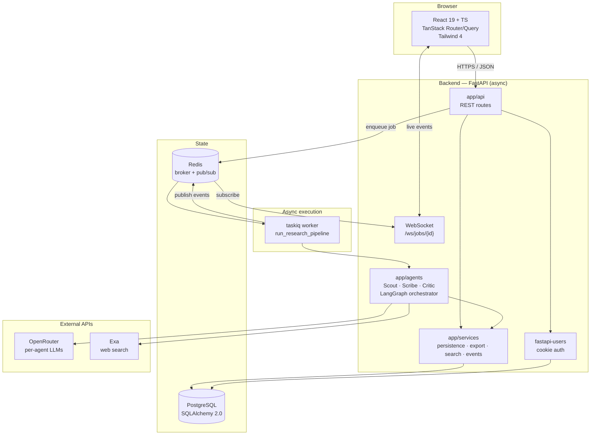
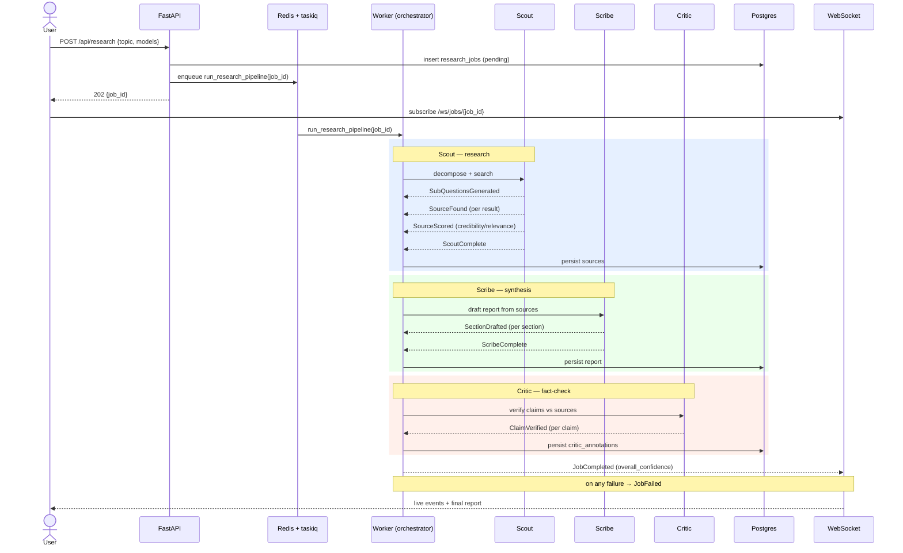
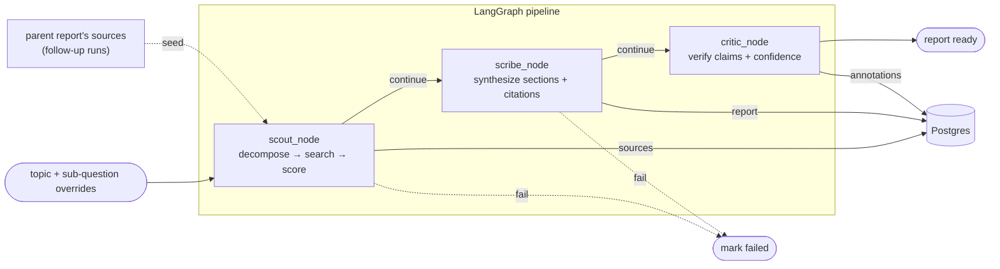
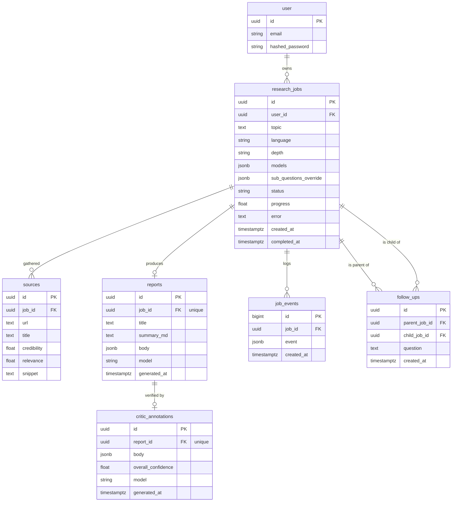

# Architecture

Synapse turns a natural-language topic into a verified research report. A user submits a topic; a
three-agent pipeline — **Scout** (research), **Scribe** (synthesis), **Critic** (fact-check) — runs
asynchronously on a worker, streaming progress events to the browser in real time, and persists a
cited, confidence-scored report.

The diagrams below render natively on GitHub.

## Component architecture

The API persists a job and enqueues it; the taskiq worker runs the LangGraph pipeline, calling
OpenRouter (LLMs) and Exa (search). Every progress event is written to Postgres (durable log) and
published on Redis, which the WebSocket relays to the browser.

## Agent pipeline — sequence

Event types are the ones defined in `backend/app/models/events.py`.

Each emitted event is appended to `job_events` (so a late subscriber can replay state via
`JobSnapshot`) and published to Redis for live delivery.

## Data flow

The orchestrator is a LangGraph state machine (`backend/app/agents/orchestrator.py`): `scout` is the
entry point, and a router advances to the next node only on success, short-circuiting to the end on
failure.

For follow-up jobs the orchestrator seeds Scout with the parent report's sources (resolved via the
`follow_ups` edge) so the run reuses prior evidence on top of a fresh, question-scoped search.

## Database — ERD

All child foreign keys are `ON DELETE CASCADE`: deleting a job removes its sources, report,
annotations, events, and follow-up edges. A follow-up's child job survives — only the edge is
dropped — so derived briefs become standalone.
